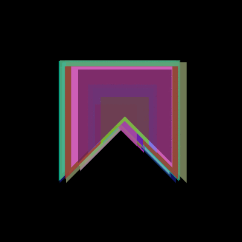

# Orientação a objetos  com bandeirinhas

## Um exemplo em 5 passos
*Para executar [instale o Processing com o modo Python](http://villares.github.io/como-instalar-o-processing-modo-python/)*
    
0. Definindo funções e deslocando o sistema de cordenadas
1. Movendo e atualizando objetos no loop principal
2. Primeira aproximação da classe Bandeirinha
3. Ampliando a classe e instanciando múltiplos objetos
4. Uma lista dinâmica de objetos
